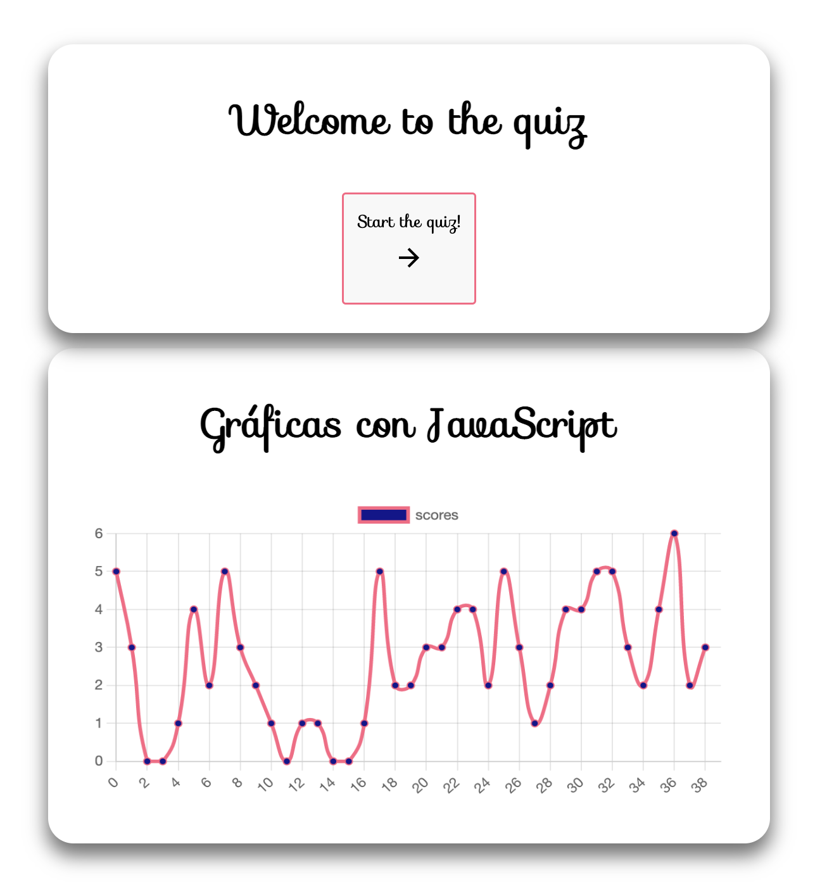
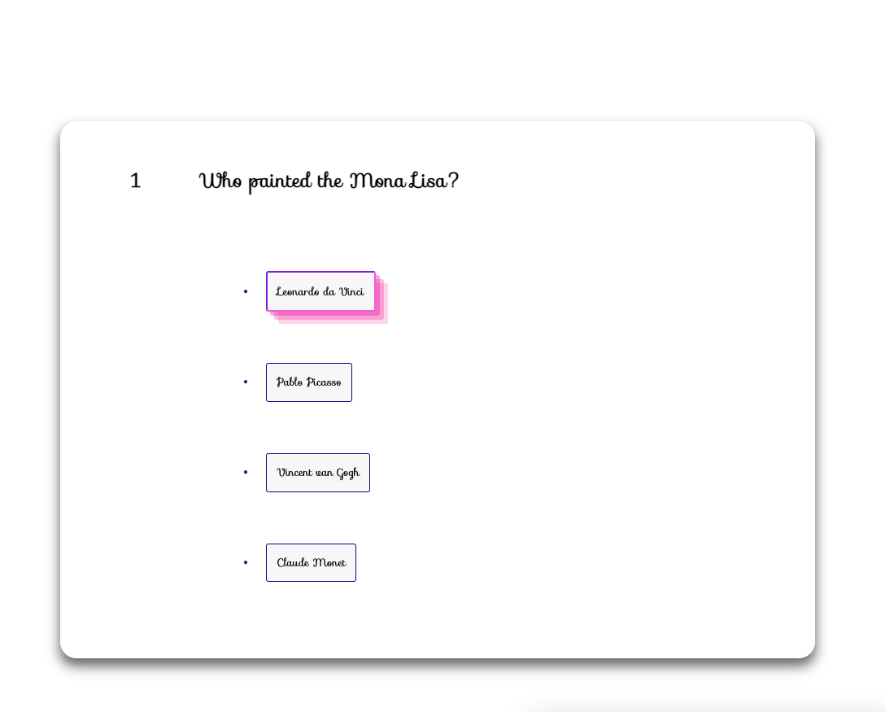
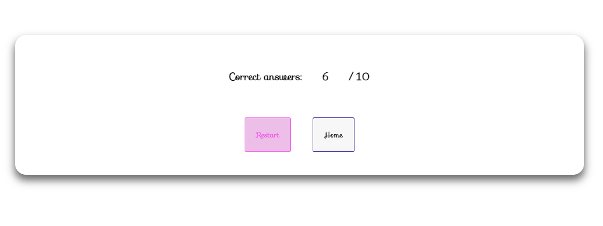

# Quiz - Ejercicio

 <h3 align="center">EJERCICIO QUIZ</h3>

  

    Ejercicio realizado durante la quinta semana del bootcamp para realizar Quiz con preguntas que vendrán de la API <a href="https://opentdb.com/">https://opentdb.com/</a>. Constará de 10 questiones con 4 opciones a elegir por cada pregunta y sólo sólo una de ellas será la correcta. Además, la aplicación es del tipo SPA(Single-Page-Application): sólo una pregunta por pantalla.
     
    <a href="https://github.com/pafz/quiz"><strong>Uso de JS, HTML y CSS</strong></a>
     
    ·
    <a href="https://github.com/pafz/quiz/issues">Report a Frontend Bug</a>
    ·
    <a href="https://github.com/pafz/bootstrap_Juanda_PatriciaF">Request a Frontend Feature</a>
    

<!-- TABLE OF CONTENTS -->

  
Contenido

  <ol>
        <li><a href="https://docs.google.com/document/d/1JOtZ2-aaR_vsBeNCB2od60ObAPs-VTnLGn-0_GCCVCI/edit" target="_blank">Objetivos</a></li>
    <li>
      <a href="#about-the-project">About The Project</a>
      <ul>
        <li><a href="#endpoints">Views</a></li>
         <li><a href="#built-with">Built With</a></li>
      </ul>   
    </li>
    <li><a href="https://docs.google.com/document/d/1qU3UZgZ3E9738ztX-6jTLlzx-SKPq7x5m2Ao5Uh8-xQ/edit" target="_blank">Cuestiones Bootstrap</a></li>
    <li><a href="#contributing">Contributing</a></li>
    <li><a href="#license">License</a></li>
    <li><a href="#acknowledgments">Acknowledgments</a></li>
    <li><a href="#contact">Contact</a></li>
  </ol>

<!-- ABOUT THE OBJECTIVES -->

## Objetivos

En este proyecto se repasa todo lo aprendido hasta el momento durante el Bootcamp de full stack.
<objectives>

  <ol>
    <li>Manipulación dinámica del DOM</li>
    <li>Crear una página SPA para las preguntas</li>
    <li>Asincronía con promesas <i>.then().catch</i></li>
    <li>Sin frameworks</li>
    <li>Gestión del proyecto con un repositorio GitHub</li>
    <li>Uso de localStorage y gráficas</li>
</ol>
</objectives>

<!-- ABOUT THE PROJECT -->

## Sobre el proyecto

En este proyecto se desarrolla una página web SPA que consta de 3 tipos de vistas. La primera es de <i>Bienvenidaen</i> en la que se visualiza la grafíca del histórico de puntos y se muestra el botón para comenzar el juego. l

Cada pregunta con sus cuatro respuestas se muentran de forma individual. A través de un botón se selecciona una única opción y justo despúes todos los botones de respuestas serán bloqueados. Durante 1 segundo a través de un <i>setTimeOut</i> se visualizará en color verde el texto del botón en caso de ser correcta, o por el contrario en color rojo en caso de ser incorrecta. Después de ese 1 segundo pasa a la siguiente pregunta de forma automática hasta llegar a la última pregunta.

Una vez finalizadas las preguntas se mostrará el resultado de ese Quiz recién realizado junto con dos botones que realizarán la función de navegador para acceder a la vista <i>Home</i> o para <i>Reempezar</i> el juego.

### Views

<views>
  <ol>
    <li>Home</a></li>
    <li>Questions [0, ,,,,,, ,9]</a></li>
    <li>Score</a></li>
  </ol>
</views>

(<a href="README.md#top">volver al principio </a>)

<!-- FUTURE -->

## Future Roadmap

- [ ] Mobile first
- [ ] Keep perfectioning styles to be funny
- [ ] Add player's ranking and initials
- [ ] Level up or be able to change the subject
- [ ] Add countdown

(<a href="README.md#top">volver al principio </a>)

<!-- LICENSE -->

## License

Este proyecto ha sido realizado como trabajo de aprendizaje por Patricia Fernández.

(<a href="README.md#top">volver al principio </a>)

<!-- PREVIEW -->

## Preview

- General overview

<!-- CONTACT -->

## Contact

  

Patricia Fernández

(<a href="README.md#top">volver al principio </a>)

